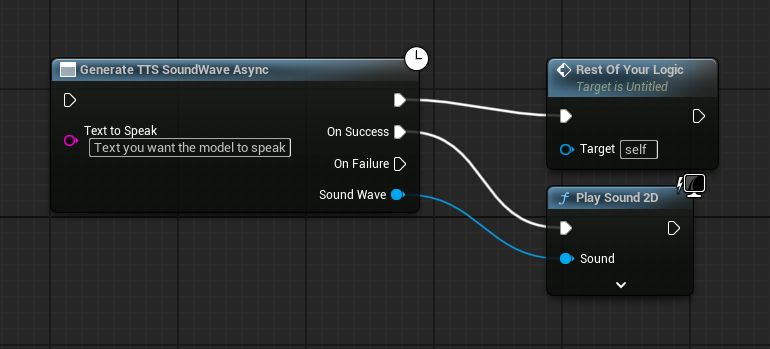

# tts_kokoro plugin

> [!Important]
> Loading the model into memory will use `~350mb` of either Ram or Vram depending on the device you load it to.

This plugin provides an easy to use interface for interacting with a local Text-to-Speech model. It allows you to generate `USoundWave` assets directly from text strings within your Blueprints.

The text-to-speech model being used is included with the plugin, and won't be something you have to worry about in general usage. But if you are interested in reading more about it you can find it here: [Kokoro-82M](https://huggingface.co/hexgrad/Kokoro-82M)

## Installation

1. Clone or download this repository.
2. Copy the `tts_kokoro` folder into your Unreal Engine project's `Plugins` directory. If the `Plugins` directory doesn't exist, create it at the root of your project.
3. Restart the Unreal Editor. The plugin should be automatically detected and enabled. You can verify this under `Edit -> Plugins`.

## How to Use

### Blueprint Nodes

  > [!Note]
  > This node performs TTS generation on a background thread, preventing hitches in the game thread. This is the recommended node for most use cases.
  
* **Generate TTS SoundWave Async (Asynchronous):**
  * Input: `Text To Speak` (String) - The text you want to convert to speech.
  * Output Pins:
    * `Regular pin`: Rest of your logic unrelated to playing the audio, is called regardless of Success or Failure
    * `On Success`: Executes when audio generation is complete. Provides the generated SoundWave object.
    * `On Failure`: Executes if audio generation fails.

### Example Usage (Blueprint)

## Third-Party Libraries

* **sherpa-onnx:** [https://github.com/k2-fsa/sherpa-onnx](https://github.com/k2-fsa/sherpa-onnx) (to load the model)
